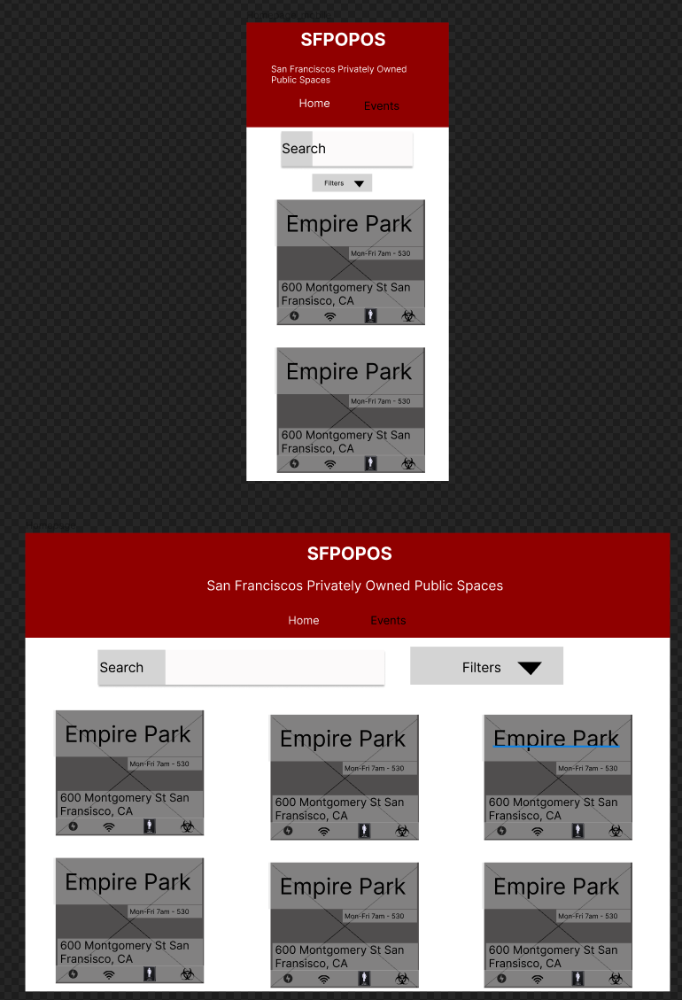
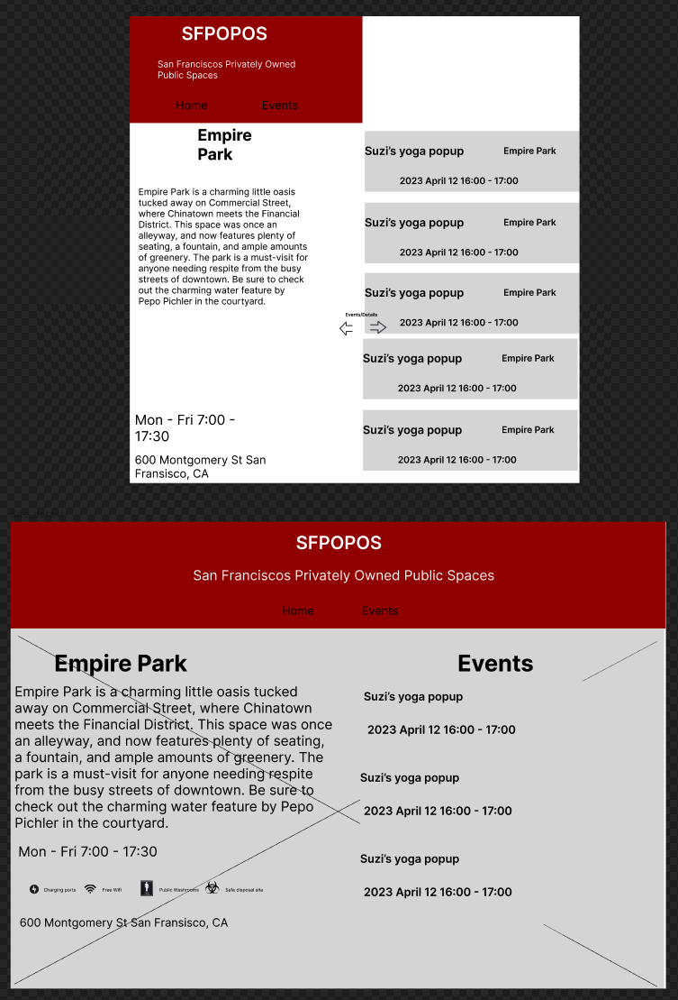
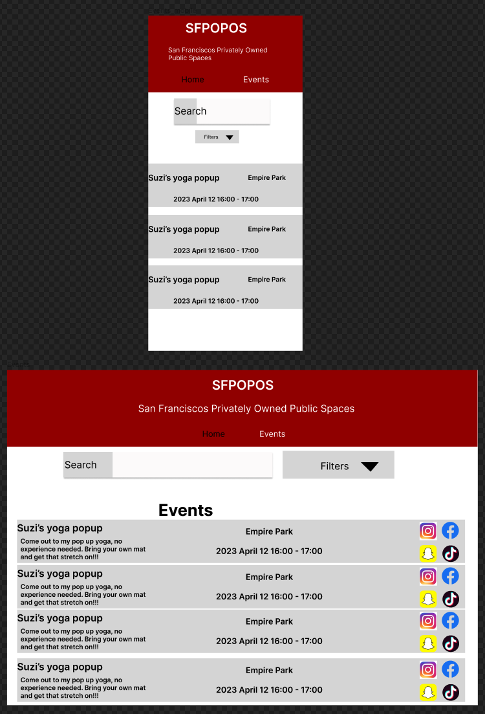
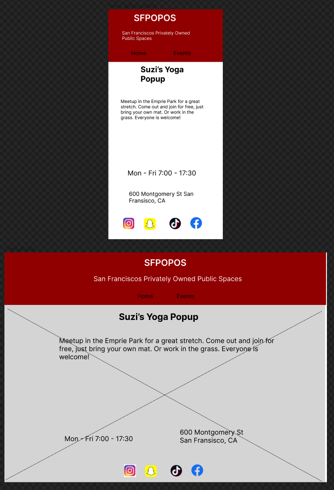

# SFPOPOS user stories, sitemap, and wireframes

## User Stories

- Mark the Entrepreneur. Mark runs his own company fully remotely, being an avid Rock climber he’s always looking for great spots outside that offer good wifi, and a fresh space to work. Mark is looking for an easy way to identify great spots that meet his wifi needs.

- Suzi is a yoga instructor. Every wednesday she runs an outdoor free event for anyone to attend in a new location. Suzi wants a way to showcase her events on the SFPOPOS site and let people know what’s going on where/when.

- Daniel is houseless. A part of the at risk community he’s looking for safety and doesn’t want to burden anyone while looking for his necessities: accessible power and public washrooms. Knowing if a site has safe use disposal would be really helpful, and knowing when events are happening would help avoid attention.

## Sitemap

Outline:

- SFPOPOS
	- Home
    - Header
		  - Page Title: SFPOPOS
		  - Subtitle: San Francisco Privately Owned Public Open Spaces
      - Nav
        - Navlink: Home
        - Navlink: Events
		- Search bar
		- Filter categories
		- List of all the SFPOPOS sites
			- Name
			- Hours
			- Events happening that day
			- Icons for each amenity offered
			- Navlink: Site Details

- SFPOPOS site details
  - Header
    - Page Title: SFPOPOS
    - Subtitle: San Francisco Privately Owned Public Open Spaces
    - Nav
      - Navlink: Home
      - Navlink: Events
	- Name
	- Description
	- Hours of operation
	- List of amenities and their hours of availability (If applicable)
	- List of Events happening on that site with their dates and times
		- Name
		- Time
		- Navlink: Event Details

- Events
  - Header
    - Page Title: SFPOPOS
    - Subtitle: San Francisco Privately Owned Public Open Spaces
    - Nav
      - Navlink: Home
      - Navlink: Events
  - Search bar
  - Filter categories
	- List of all events in the City
		- Name
		- Location
		- Time
		- Navlink: Event details

- Event details
  - Header
    - Page Title: SFPOPOS
    - Subtitle: San Francisco Privately Owned Public Open Spaces
    - Nav
      - Navlink: Home
      - Navlink: Events
	- Name
	- Description
	- Location
	- Navlink: SFPOPOS Site Details
	- Time happening
	- Who is hosting
	- Social media links for the event/organiser

## Wireframes

https://www.figma.com/file/DGkpMB9vJyDLvxFEEW0W4c/SFPOPOS-Wireframe?node-id=0%3A1&t=IOIdlG6jGIvHFpbH-1

### Homepage

### Site Details

### Events

### Event Details

